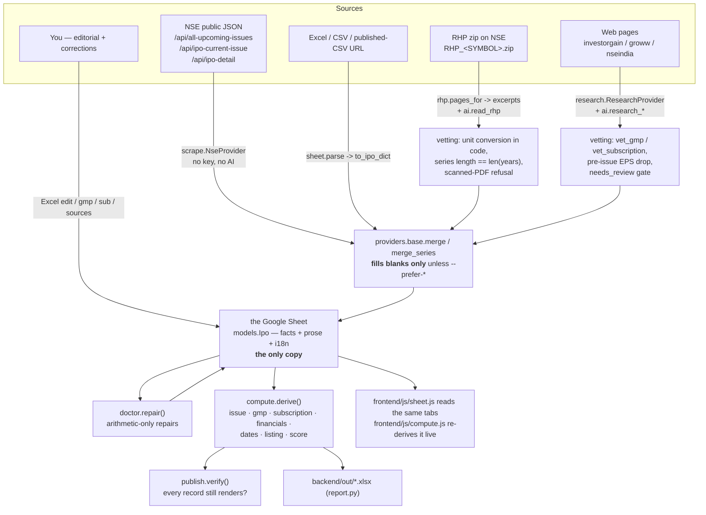

# IPO Pulse — Backend Developer Guide

The backend is a Python CLI (`ipopulse`) that reads and writes **one Google Sheet**
holding every IPO, and derives every metric from it. There is no server and no
database process: the sheet IS the database.

The frontend reads the same sheet (`frontend/js/sheet.js`, via Google's
credential-free CSV export) and re-derives the numbers with `compute.js`. Nothing is
published in between and nothing is committed, so the two sides cannot drift apart —
a pipeline run is live the moment it finishes.

Two consequences worth internalising: **every command needs the network and the
service account**, and **the sheet must be world-readable** for the site to load it,
because a static page has nowhere to hide a credential.

```
backend/
  ipopulse/
    cli.py              every command; argparse wiring; also the in-process job runner
    models.py           the Ipo dataclasses = the sheet schema
    sheets.py           THE STORE: Google Sheets I/O, batched reads, whole-tab writes
    tables.py           the tab layout + record<->rows, shared with the browser
    workbook.py         local .xlsx snapshots (backups only, not the store)
    store.py            load/save/scaffold/remove on top of sheets.py
    compute.py          ALL derived metrics + the 0-10 score. No LLM number ever lands here.
    publish.py          verifies every record still derives (there is nothing to publish)
    doctor.py           completeness checks, consistency checks, arithmetic repairs
    ai.py               Gemini wrapper: model discovery, cache, prompts, vet_gmp/vet_subscription
    control.py          JOBS dict, CHAINS, /trigger panel + /api/* endpoints
    report.py           Excel workbook (openpyxl)
    providers/
      base.py           Provider protocol, merge(), merge_series()
      scrape.py         NSE — keyless JSON, issue terms + subscription
      rhp.py            NSE's Red Herring Prospectus zip -> text -> excerpts
      research.py       Gemini grounded lookup (proposes, never decides)
      sheet.py          Excel/CSV import (lenient)
      sheet_push.py     Google Sheets upsert (strict, round-trip safe)
      manual.py         the stored records themselves, as a provider
      api.py            skeleton for a future HTTP feed
  data/cache/           Gemini response cache + discovered-model cache
  .cache/               RHP text extracts, enrich attempt log (gitignored)
  out/                  reports + backups (gitignored — all of it is regenerable)
frontend/js/config.js   generated, gitignored: the sheet id the browser needs
THE DATABASE            a Google Sheet; nothing in the repo holds IPO data
```

Entry point: `python -m ipopulse.cli <command>` from `backend/`, or `ipopulse` if the
package is installed (`[project.scripts]` in `pyproject.toml`).

---

## 1. Data flow, end to end



Narrative, in the order a number actually travels:

1. **Ingest.** `sync --provider nse --discover` reads NSE's catalogue, scaffolds any IPO
   not yet tracked, and merges issue terms + today's subscription row. `research`/`rhp`
   fill what NSE does not publish. `import` folds in a spreadsheet.
2. **Merge.** Every provider returns a *partial* `Ipo`-shaped dict. `merge()` deep-merges
   it into the stored record and **only fills genuinely empty fields** — a hand-typed
   value is the correction of record and is never silently overwritten (`--prefer-api` /
   `--prefer-sheet` invert this deliberately). Time series go through `merge_series()`,
   which unions on a key (`date` for GMP, `day` for subscription) so re-running the same
   day updates the row instead of duplicating it.
3. **Store.** One Google Sheet, normalised across tabs (`IPOs` wide, the rest long and
   keyed by `slug`). Dates are written as **text** with `valueInputOption: RAW`, so no
   locale or epoch can reinterpret them. A save clears and rewrites whole tabs; there is
   no lock and no transaction, so concurrent writers are last-write-wins — the
   scheduler's `concurrency:` group is what keeps that from happening.
4. **Repair.** `doctor --fix` fills only what follows arithmetically (fresh+OFS totals,
   the T+3 calendar, `shares_post_issue_cr = PAT / EPS`, the registrar's status URL).
5. **Derive.** `compute.derive(ipo)` recomputes everything: nothing derived is ever
   stored. `score_metrics` runs last and takes the other blocks as input, so the score is
   a weighting of already-derived numbers, never a fresh reading of the IPO.
6. **Verify.** There is nothing to publish — the sheet the browser reads is the one
   the backend just wrote. `build` now *checks* instead: it derives every record and
   fails if any would render blank. Committing the sheet is the deploy;
   `.github/workflows/publish.yml` then pushes `frontend/` to Pages.
7. **Render.** `frontend/js/xlsx.js` unzips the sheet in the browser
   (`DecompressionStream` + `DOMParser`, no library) and `js/data.js` rebuilds the same
   records, mirroring `tables.from_tables` and `models.from_dict`. `compute.js` then
   re-derives everything. **Three mirrored pairs now: compute, the sheet layout, and the
   model defaults. Change one side and you must change the other.**

---

## 2. CLI reference

Run everything from `backend/`. Global behaviour in `main()`: stdout/stderr are forced to
UTF-8 (Windows consoles are cp1252 and cannot encode `₹` or `—`), then `.env` is loaded
from `backend/.env` or the repo root `.env` with `setdefault` semantics (a real
environment variable always wins).

"AI" below counts **Gemini requests**, which is what the free tier actually binds on —
see §9.

| Command | What it does | Key flags | AI |
|---|---|---|---|
| `new <slug>` | Adds a blank row to the sheet. `board` and `registrar` are left unset *on purpose* — see §8. | `--force` overwrite | none |
| `remove <slug>` | Drops an IPO from the sheet. Backs the book up to `out/ipo-pulse.prev.xlsx` first, since a row deletion has no git diff to undo. | `--yes` to confirm | none |
| `list` | Table of every tracked IPO: status, latest GMP, latest total subscription. | — | none |
| `gmp <slug> <value>` | Logs one grey-market point. Defaults to today. Goes through `merge_series` so re-logging a date updates it. | `--date --kostak --sauda --source` (default `manual`) | none |
| `sub <slug> <day>` | Logs one bidding day. Keyed on `day`, merged field-wise, list re-sorted. | `--date --qib --nii --retail --employee --total` | none |
| `sync` | Pull a provider into the sheet. `--provider nse` is the workhorse: keyless, no AI. `--discover` scaffolds IPOs NSE lists that we do not track (without it, a "live" feed can never introduce a new listing). | `--slug --provider manual\|api\|sheet\|nse\|research --prefer-api --discover --no-translate --model` | 0 for the fetch; **2 per touched IPO** for the auto-translate unless `--no-translate` |
| `translate [slug]` | Gemini → `hi`,`te`, written into `ipo.i18n`. Hard-cached 30 days on `{model, lang, fields}`. | `--langs hi,te --model --force` (bypass cache) | 1 per language per IPO, **0 on a cache hit** |
| `analyse <slug>` | Drafts `overview / green_flags / red_flags / growth / valuation / risk` from the derived facts only. Prints unless `--write`. | `--write --force --no-translate --model` | 1 (cached on `{model, context}`) + 2 if `--write` triggers translation |
| `import <file\|url>` | Excel/CSV/published-CSV → the sheet. Fuzzy header matching (`sheet.ALIASES`), reports unmatched and skipped columns. | `--kind ipos\|gmp --sheet --slug --prefer-sheet --dry-run --no-translate` | 0 + 2 per touched IPO for auto-translate |
| `job [names…]` | Runs named jobs from `control.JOBS`, expanding chains, **in-process** via `main(argv)`. Stops at the first non-zero exit. No args = list every job and its schedule. | — | whatever the jobs cost |
| `push [slug]` | Upserts into a Google Sheet. Matches rows on slug(company) (+date for GMP), preserves columns it does not know. Needs a service account. | `--kind ipos\|gmp --tab --sheet-id --dry-run` | none |
| `research <slug>` | Gemini grounded lookup. `--what` selects the aspect. Every value comes back with sources, confidence and `needs_review`. **Exits 2** when anything was flagged and `--force` was not given. | `--what gmp\|gmp-history\|sub\|ipo\|financials\|both\|all --url --write --force --model` | 1 grounded call per aspect (`all` = 4) |
| `rhp <slug>` | Downloads NSE's RHP zip, extracts text, sends only the matching sections, converts units in code, writes `financials` + `dates.announced`. | `--symbol --series EQ\|SME --write --force --refresh --model` | 1 (no tools — the text is in the prompt) |
| `sources <slug>` | Show or pin the exact page to read per role (`gmp`, `issue`, `subscription`). A pin removes the two ways grounded lookup fails: wrong company, stale cached page. | `--set ROLE=URL` (empty URL unpins) | none |
| `refresh` | The daily grey-market loop: re-read GMP for every IPO not yet `listed`, optionally subscription for `open` ones, then `publish()`. Flagged values are printed and **not written**. | `--slug --subscription --all --force --model` | 1 per live IPO (+1 each for subscription) |
| `cache` | Inspect / prune / clear the Gemini response cache. Pruning never loses text: translations also live on the I18n sheet. | `--days 30 --prune --clear` | none |
| `enrich [slug]` | Takes an IPO from "discovered" to "complete" by dispatching the same commands a human would (`research --what ipo`, `rhp`, `analyse`, `translate`), planned from what is **absent**. Budgeted and idempotent; then runs `doctor --fix` and republishes. | `--max-ai 12 --dry-run --retry-after 7 --retry` | up to `--max-ai`; the untried tail is reported, never dropped |
| `doctor [slug]` | Lists what is missing **and which scene it blanks**, plus GMP/subscription gaps, staleness, and internal contradictions. `--fix` applies arithmetic repairs and republishes. | `--fix --strict` | none |
| `build` | `derive()` + `publish()` for every IPO. Pure local computation — no network, no key. | `--prune-cache --days 30` | none |
| `report [slug]` | Excel workbook into `backend/out/`. Derived columns come from `compute.py`, so the sheet and the card cannot disagree. | `-o/--output` | none |
| `serve` | Static server for `frontend/` **plus** the `/trigger` panel and `/api/*` in one process/port. `Cache-Control: no-store` on everything. | `--port 8000 --host` | none |

Notes worth knowing:

* **Auto-translation happens at ingestion, not at build.** `import`, `sync` and
  `analyse --write` call `maybe_translate()` so Gemini runs once per *data change*
  instead of once per build. If Gemini is unconfigured it is silently skipped — the site
  still builds, captions just stay English.
* **`serve` refuses to bind a non-loopback host without `IPOPULSE_TRIGGER_PASSWORD`.**
  Exposed `/trigger` with no password is a remote command runner, so it errors rather
  than warns.
* **`doctor` returns 0 even with findings** unless `--strict`. Findings are the normal
  state of a live IPO; exiting 1 would stop the daily chain on an IPO that simply has no
  financials yet. `--strict` is the pre-recording gate.
* **`research` returning 2** is a real exit code, so an automation can distinguish
  "flagged, needs a human" from "failed".

---

## 3. Jobs, chains and schedules

`control.JOBS` is the single registry. The timers, the `job` subcommand and the browser
panel all resolve the same names through the same dict, so a schedule and the panel can
never drift apart. `argv` is a **list**, never a shell string, and there is no endpoint
that accepts a command — so there is nothing to inject into.

| Job | argv | Schedule (IST) |
|---|---|---|
| `sync` | `sync --provider nse --discover --no-translate` | part of `daily` |
| `enrich` | `enrich --max-ai 6` | part of `daily` |
| `doctor` | `doctor --fix` | part of `daily` |
| `build` | `build` | part of `daily` |
| `push` | `push` | part of `daily` |
| `gmp` | `refresh` | part of `grey` |
| `push-gmp` | `push --kind gmp --tab GMP` | part of `grey` |
| `translate` | `translate` | Sun 03:00 |
| `report` | `report` | Sun 04:00 |
| `daily` | composite | 10:00 & 18:35 daily |
| `grey` | composite | 23:45 daily |

```python
CHAINS = {
    "daily": ["sync", "enrich", "doctor", "build", "push"],
    "grey":  ["gmp", "push-gmp"],
}
```

Why chained rather than scheduled 15 minutes apart: a push behind a slow sync would
publish yesterday's numbers as today's. Inside a chain, step N+1 cannot start until step
N has exited 0.

* `doctor` sits **between** sync and build so the T+3 calendar and registrar URL are
  filled from whatever NSE just supplied, before JSON is written. It never exits non-zero
  without `--strict`, so it cannot break the chain.
* `enrich` sits **right after** sync, because sync is what discovers a new IPO and enrich
  is what makes it usable. Its budget is only 6 calls precisely because the chain runs
  twice a day — the work spreads across runs instead of exhausting the free tier in one.
* Two daily triggers, not one: Indian bidding runs 10:00–17:00 IST and subscription is a
  running total that only moves inside that window. 10:00 puts a new issue's day 1 on file
  as bidding opens; 18:35 takes the settled figures well clear of the close.
* `grey` is at **23:45**, and the time is measured, not guessed. InvestorGain opens a row
  for the day at 05:55 and then revises it in place all day — `last_updated` for a
  finished day lands at 23:28–23:37 across its whole board. The old 21:00 slot could only
  ever capture a mid-session quote: 16 Aug 2026 was stored as Skytech 10 / Tempsens 85
  when the settled figures were 7 and 65. `gmp-sync --reconcile` re-walks the dated table
  each night and rewrites any day the desk has since revised, so a late correction still
  lands; running after the settle just means it is right the first time.
* `grey` ends in `build` rather than chaining the whole of `daily`, so the night's GMP is
  still verified without running `sync` fifteen minutes before midnight — which would file
  a bidding day under tomorrow the moment the run drifts.

> Drift to be aware of: `JOBS["daily"]["detail"]` still reads "sync → doctor → build →
> push" and `deploy/windows/Register-IpoPulseTasks.ps1` says "sync,build,push". `CHAINS`
> is authoritative — `enrich` is in the chain.

### Two runners

| | `cli.cmd_job` | `control.Runner` |
|---|---|---|
| Used by | timers, GitHub Actions | the `/trigger` panel |
| Execution | in-process `main(argv)` | `subprocess.Popen([sys.executable, "-m", "ipopulse.cli", *argv])`, `shell=False` |
| Output | stdout | 400-line ring buffer polled by `/api/status` |
| Concurrency | none | one job at a time; a second request gets HTTP 409 |

### The `/trigger` panel

Served only by `ipopulse serve`, and the HTML lives in `control.py` **not** in
`frontend/` — because `frontend/` is published verbatim to Pages, and a password checked
in browser JS on a public static site is not a password.

`GET /trigger` (HTML) · `GET /api/health` · `POST /api/login` · `GET /api/jobs` ·
`GET /api/status` · `POST /api/run` (`{"job": "sync"}` or `{"jobs": [...]}`, max 20).
Everything past login needs an `X-Token` header.

Auth: password from `.env`, compared with `hmac.compare_digest`, exchanged once for a
random `secrets.token_urlsafe(32)` with an 8-hour TTL. Five bad attempts lock that client
address for 5 minutes.

### GitHub Actions

**`.github/workflows/schedule.yml`** — the GitHub-hosted half of `deploy/`. Pages is
static hosting and runs no processes, so a timer cannot live "on Pages"; Actions runs the
job, commits the regenerated JSON, and the push to `frontend/**` makes `publish.yml`
redeploy.

Cron is UTC with no timezone option, so every entry is IST − 5:30:

| cron (UTC) | IST | jobs |
|---|---|---|
| `30 4 * * *` | 10:00 daily | `daily` |
| `5 13 * * *` | 18:35 daily | `daily` |
| `15 18 * * *` | 23:45 daily | `grey` |
| `30 21 * * 6` | 03:00 Sun | `translate` |
| `30 22 * * 6` | 04:00 Sun | `report` |

Plus `workflow_dispatch` with a free-text `jobs` input. Actions cron is best-effort and
can start 5–20 minutes late under load, which is why nothing is timed to land on a
deadline — 18:35 is clear of the 17:00 close with room to drift, and for the 23:45 GMP run
drift only helps, since late is further past InvestorGain's settle rather than before it.
`concurrency: ipopulse-data, cancel-in-progress: false` stops the 23:45 run overlapping a
slow 18:35 one, since they write the same sheet. Note it guards Actions against itself
only — it cannot see a run on your own machine.

Three details that were each a bug once:

* The service-account JSON is written to `$RUNNER_TEMP/sa.json` from an **env var**, not
  interpolated into the script (the JSON contains quotes and braces that would end the
  shell quoting). It is deleted in an `if: always()` step.
* **If there is no Sheets key, the push steps are removed from the chain** rather than
  run into a certain failure — otherwise a good GMP read was thrown away because a
  spreadsheet could not be written.
* **The commit step is `if: always()`.** Jobs write to disk as they go, so by the time a
  later step fails the earlier ones have already produced real data. Without this, one
  failing push discarded a whole run's GMP.

**`.github/workflows/publish.yml`** — deploys `frontend/` as the **site root** via
`actions/upload-pages-artifact` with `path: frontend` (requires Pages *Source: GitHub
Actions*; branch-deploy can only serve `/` or `/docs`, which is why it used to show the
README). Triggers on pushes touching `frontend/**` (which now includes the sheet) or itself.

It re-runs `ipopulse build` before publishing so the site can never lag the sheet because
someone forgot. The condition is `if: github.event_name != 'workflow_dispatch' || inputs.rebuild`
and **not** `inputs.rebuild != false`: on a push `inputs.rebuild` is null, GitHub coerces
null and false both to 0 across types, so `null != false` is FALSE and the build silently
skipped on every push — exactly the case it exists for.

Then **the gate**: a `grep -rIn` over `frontend/` for `AIza…`, `AQ.…`, `BEGIN … PRIVATE
KEY`, assignments to `GEMINI_API_KEY` / `IPOPULSE_TRIGGER_PASSWORD` / `GOOGLE_SHEETS_ID`,
and `iam.gserviceaccount.com`. It runs **before** the deploy, never after.

---

## 4. Where every field comes from

This is the section to read before adding a field. Four sources, in descending order of
trustworthiness: **manual > NSE > RHP > Gemini research**.

### 4a. NSE (keyless, no AI) — `providers/scrape.py`

NSE *is* the primary record for issue terms and subscription, so there is nothing to vet.
The endpoints are the ones nseindia.com's own pages call: public, undocumented, and they
401 any JSON request made without a session cookie — hence `_Session`, which loads
`/market-data/all-upcoming-issues-ipo` first, sends a browser User-Agent (the urllib
default is rejected outright), handles gzip, and rate-limits itself to one call per 0.7s.

| Field | Endpoint | Extraction |
|---|---|---|
| `slug` | catalogue | `slugify(companyName)` — same shape as the sheet importer's, so both agree |
| `company` | catalogue | `companyName` |
| `board` | catalogue | `series == "SME"` → SME, else Mainboard. **Not cosmetic**: the detail endpoint keys on series and answers an EQ query about an SME issue with a full set of nulls rather than an error |
| `issue.price_low/high` | catalogue `issuePrice`, then detail `Price Range` | `_band()` regex over `Rs.829 to Rs.871` shapes |
| `issue.total_cr` | catalogue `issueSize` × `price_high` / 1e7 | `issueSize` is a **share count**, not rupees. It also counts only the *fresh* shares, so it understates any issue with an OFS leg — Molbio published ₹658 Cr against a real ₹939.7 Cr |
| `issue.fresh_cr` / `ofs_cr` | detail `Issue Size` prose | `_split_from_issue_size()`: splits on "offer for sale", then takes the **first** money-or-share figure in each segment. Handles all three shapes NSE uses (both in rupees, both in shares, mixed). The trailing "(including Employee Reservation Portion …)" is a subset of the offer, not another leg, hence *first figure only*. A share count is converted at the upper band. This was written off as "RHP only" for the whole project; it is right there, keyless — and it is the number the fresh-vs-OFS scene turns on |
| `issue.total_cr` (corrected) | derived | `fresh + ofs` whenever either is found |
| `issue.lot_size` | detail `Bid Lot` / `Minimum Order Quantity` | first integer |
| `issue.registrar` | detail `Name of the Registrar` | verbatim |
| `dates.open` / `close` | catalogue `issueStartDate`/`issueEndDate`, detail `Issue Period` | `_date()` over `10-Aug-2026` etc. |
| `dates.allotment/refund/listing` | **derived** from `close` | SEBI T+3: close + 1/2/3 **working** days, weekends skipped. Does not know exchange holidays, so a date landing on one is a day early — which is fine because these fill blanks only and a typed value always wins |
| `subscription.{qib,nii,retail,employee,total}` | detail | Prefer `activeCat[].noOfTotalMeant`, fall back to `bidDetails[].noOfTime`. Mainboard fills `bidDetails`; SME leaves it absent and only fills `activeCat`. Category matched on a substring of long names, first match (the heading) wins; `activeCat`'s first row is a header whose "values" are column captions, so a non-numeric value aborts that field |
| `subscription.day` | derived | `today - dates.open + 1` |
| **`gmp_history`** | — | **Always `[]`.** No exchange publishes grey-market data. Returning nothing is the honest answer; inventing one here would put an unsourced figure straight into the sheet |

Before bidding opens every category reads zero or null, which is indistinguishable from
"nobody has bid yet" — so a row of all-zeros is discarded rather than written over a real
figure.

### 4b. The RHP zip (keyless download, 1 Gemini call) — `providers/rhp.py` + `cli.cmd_rhp`

NSE links the Red Herring Prospectus from the same detail endpoint, as a zip of proper
text PDFs (`.../content/ipo/RHP_<SYMBOL>.zip`). The whole chain is free.

Pipeline: `rhp_url()` → download → open zip → pick the **largest** PDF that is not
`GID.pdf` (the General Information Document is identical boilerplate across every issue)
→ `pypdf` per-page text → cache to `backend/.cache/rhp/<slug>.json` **with no TTL** (an
RHP is filed once and never changes; the download+parse takes ~100s and the extract is
~1.5M chars) → `excerpts()` picks pages by keyword within a 90,000-char budget →
`ai.read_rhp()` with **no tools at all**.

Sections selected, in priority order (`rhp.SECTIONS`): `peers` (comparison with listed
industry peers), `kpi`, `basis` (basis for the offer price), `capital` (capitalisation
statement / total borrowings), `ratios` (RoNW / NAV per share / EPS).

| Field | Source |
|---|---|
| `financials.years` | the model's own labels win over the scaffold's — an issue coming to market in 2026 has FY24–FY26, and forcing FY23–FY25 onto it made the read fail as "incomplete" when it had found everything |
| `financials.revenue / ebitda / pat / net_worth / total_debt` | extracted **as printed**, converted in code (see §5) |
| `financials.eps` | post-issue EPS, rupees, unaffected by `unit` |
| `financials.pe_peer_avg` | mean P/E of the *listed peers* shown, explicitly not the company's own |
| `dates.announced` | `rhp.filing_date()` — **no model involved.** Regex `Dated <Month> <D>, <Y>` over the first three pages only, and, given `dates.open`, restricted to the 200 days before it. Latest surviving candidate wins. Unbounded, the first match gave Credent Connect an announcement date 825 days early, from a superseded draft's cover page. Because it comes from the text and not the model, it is written even when the figures are flagged |

### 4c. Gemini grounded research — `providers/research.py` + `ai.research_*`

Use each site for what it is actually authoritative on. This is the single biggest
accuracy lever:

| Site | Good for | Bad for |
|---|---|---|
| investorgain.com | GMP (dated live table); publishes `Content-Signal: search=yes, ai-input=yes` | — |
| groww.in | issue details and live subscription (SEBI-registered broker republishing exchange data) | **GMP** — a regulated broker stays away from unofficial data |
| nseindia / bseindia | subscription, issue terms | GMP |
| ipowatch.in | second opinion on GMP | **dropped as a default**: its robots.txt sets `Content-Signal: ai-train=no` and disallows AI fetchers. Pin it per-IPO if you decide otherwise |

`SITES` holds the per-role fallbacks; `ipo.sources` pins beat them. `urls_for(role, ipo)`
returns pinned-first. **Passing `ipo=` matters** — without it `urls_for` falls back to
site defaults, which are *index* pages listing every IPO, so a pin was silently ignored
and the lookup read a directory instead of the company's page.

| `--what` | Fills | Vetted by |
|---|---|---|
| `ipo` | `company, board, sector, issue.{fresh_cr,ofs_cr,price_low,price_high,lot_size,shares_post_issue_cr,registrar}, dates.{announced,open,close,allotment,listing}` | reported with confidence + sources; written with `merge(prefer_incoming=False)` so it only fills blanks |
| `gmp` | one `gmp_history` point (`date, gmp, kostak, source: gemini`) | `vet_gmp` |
| `gmp-history` | the whole dated table, for backfilling gaps | `vet_gmp` **per row** — one bad row is dropped instead of poisoning the backfill |
| `sub` | one `subscription` row | `vet_subscription` |
| `financials` | the FY table + `eps` + `pe_peer_avg` | length checks + pre-issue-EPS detection |

Tool selection is a cost decision, verified 2026-08-10: `url_context` is free on this
tier, `google_search` is not and 429s immediately without billing. So **when a URL is
pinned, only `url_context` is attached and search is not** — one unnecessary tool turns a
call that would have worked into a quota error. Search stays the fallback for the
un-pinned case. Google's fetcher also renders the JavaScript GMP tables that a plain HTTP
scraper only sees as "No data available".

Known limitation, learned the hard way: the investorgain *board* URL carries only today's
value per IPO. The dated day-by-day table lives at `/gmp/<company>-ipo/<id>/`, `<id>` is
not derivable from the slug (read it off the board once and pin it), **and that table is
lazy-loaded on scroll** — `url_context` renders JS but does not scroll, so it sees an
empty tbody. `--what gmp-history` therefore works only on sources that render history
server-side. Which is why a day lost to a failed job usually cannot be recovered:
fixing the schedule matters more than the backfill.

### 4d. Spreadsheet — `providers/sheet.py`

Lenient by design: headers are normalised (`'Price Band (High) ₹'` → `pricebandhigh`) and
matched against `ALIASES`, the header row is picked as whichever of the first 10 rows maps
best, unmatched columns are reported rather than dropped, `(123)` reads as −123, and ten
date formats are tried. `kind=gmp` requires a GMP number per row; `kind=ipos` requires a
company name. Financial columns become a one-element series labelled `"Latest"`.

`sheet_push.py` is the mirror and has the opposite problem — it *defines* the schema — so
its header row is built from `sheet.ALIASES`, making the round trip closed by
construction. Writes are an **upsert** keyed on slug(company) (+date for GMP). Values go
up with `valueInputOption=RAW`; dates are written as ISO **text** deliberately, because a
real date cell renders per the sheet's locale and a US-locale export of `8/12/2026` is
read back by `to_date` as 8 December (it tries `%d/%m/%Y` first). Fields worth `0`/`0.0`
are omitted, since that is the dataclass default for "not filled in", not a real zero.

### 4e. Derived by `doctor --fix`

| Repair | Rule |
|---|---|
| `issue.total_cr` | `= fresh + ofs`. Applied even when a different total exists — that case is common, not theoretical (NSE's `issueSize` counts fresh shares only) |
| `issue.ofs_cr` / `fresh_cr` | the complement, when total and exactly one leg are known |
| `dates.allotment/refund/listing` | close + 1/2/3 working days, blanks only |
| `dates.close_time` | `17:00` |
| `issue.shares_post_issue_cr` | `= PAT_latest / EPS`, by definition. **Guarded**: rejected unless implied market cap exceeds the issue size, because a smaller one means the EPS is on a different basis (pre-issue, or another year) |
| `issue.registrar_url` | `_match_registrar()` on a squashed alphanumeric substring — registrars are spelt a dozen ways ("KFin Technologies Limited", "Kfintech", "MUFG Intime India Private Limited") |

Never repaired, on principle: carrying a GMP forward across a day nobody read it,
guessing a listing range from the current premium, inferring a sector from the name.
*If two people with the same sheet would write down different numbers, it is not a
repair.* Those stay findings forever rather than becoming quiet fabrications.

### 4f. Manual only

`analysis.*` (all of it, including `score`, `verdict`, `reco_*`, `*_tone`),
`allotment.status/listing_low/listing_high/steps`, `benchmarks`, `sources`, `notes`,
`initials`, and any correction to anything above.

---

## 5. Guard rails

The governing rule, stated in `ai.py` and enforced in `compute.py`: **nothing Gemini
returns is ever computed with.** A fetched GMP is stored like any other data point, with
`source: gemini`, and every derived number comes from `compute.py` operating on stored
data.

### `vet_gmp(result, price_high)` — `ai.py`

Flags (`needs_review=True`) and the CLI then refuses to write without `--force`:

| Condition | Reason |
|---|---|
| `gmp is None` | "no figure found" — and a null is explicitly a *correct* answer in the prompt |
| no `sources` | "no source citation" |
| `confidence == "low"` | model's own report |
| no `date` | "undated figure" |
| `gmp/price_high` > **150%** or < **−30%** | "implausible: N% of the price band" — a value outside that range is almost always the Kostak rate or a per-lot amount misread as GMP |

### `vet_subscription(result)` — `ai.py`

The failure mode here is staleness and unit confusion, not invention, so the checks are
about shape: no figures at all · no citation · low confidence · undated · any negative
multiple · any multiple **> 1000x** (that reads as an application count or a rupee
amount) · a total outside `[min/1.5 − 1, max×1.5 + 1]` of the per-category range.

### Financial series length

The most dangerous shape in the file. `compute.py` zips `years` against each series **by
index**, so a short array silently slides FY25's revenue into FY24's row and every CAGR,
margin and benchmark downstream is computed from a table nobody typed. Checked in three
places:

* `research.fetch_financials` — `len(vals) != len(years)` → problem, series dropped;
  a `None` inside an array → problem (distinct from a length mismatch, because reporting
  "3 values for 3 years" reads as a contradiction).
* `cli.cmd_rhp` — the same check on the RHP read.
* `doctor.inconsistencies` — the standing check on whatever is in the sheet.

`fetch_financials` sets `needs_review` when **any** problem exists, or confidence is not
`high`, or nothing was found — because financials feed 45% of the score's weight.

### Unit conversion happens in code, never in the model

Asked to "convert to crore", the model politely reported millions instead and noted the
unit in prose. Every figure was 10× too big, and nothing about a plausible ₹8,365 crore
revenue looks wrong on a card. So the prompt now demands the figures **exactly as
printed** plus the unit as a field, and `cli.cmd_rhp` does the arithmetic where it can be
read:

```python
TO_CRORE = {"crore": 1.0, "cr": 1.0, "million": 0.1, "mn": 0.1,
            "billion": 100.0, "bn": 100.0, "lakh": 0.01, "rupees": 1e-7}
```

An unrecognised unit sets `factor = 0.0` and **discards every series** — a missing figure
beats a wrong one. `_f()` strips thousands separators and the Unicode minus, because the
RHP prints `3,719.44` and the model is copying it as printed, exactly as instructed;
rejecting those as non-numeric threw away whole clean reads.

### Scanned-PDF detection

The companion "Ratios / Basis of Issue Price" document is a scanned newspaper
advertisement whose fonts carry no ToUnicode map: `pypdf` returns thousands of characters
of which none are digits. `rhp._readable()` rejects an extract shorter than 2,000 chars
or with a digit density below **0.5%**, and `cmd_rhp` stops there — *"Nothing was sent to
the model."* The alternative is handing a model a wall of mojibake and believing the tidy
JSON it invents from it.

### Peer-column confusion and pre-issue EPS

`read_rhp`'s prompt is explicit that several pages put our company beside its listed
peers, and that a `null` beats a guess. Separately, summary pages very often print the
**pre-issue** EPS while `financials.eps` means post-issue — pre-issue is the larger
number (fewer shares), so accepting one silently publishes a P/E that flatters the issue.
`research.py` regexes the model's own note for `pre-?(ipo|issue)` and drops the field if
found.

### Merge rules

* `merge()` fills **blanks only** by default. `empty` counts `None, "", [], {}, 0` — note
  that a numeric `0` is treated as empty and can therefore be filled.
* `merge_series()` unions on `date` (GMP) or `day` (subscription). Subscription keys on
  `day` because the exchange reports a running total for the whole window, so syncing
  twice in a day must overwrite that day rather than append to it.
* **Researched values only fill holes.** `research --what gmp-history` writes rows you do
  not have; rows that *disagree* with a stored value are printed with `≠` and left alone
  unless `--force`. A reading taken live on the day is not automatically worse than a
  page's later memory of it.
* **An empty result never clears a populated one.** Two runs of the same lookup do not
  return the same thing: a re-run of LEAP India came back with rounded revenue and no PAT
  at all, and a blanket `.update()` wrote that over a precise three-year series. A second
  opinion should be able to add, not to erase. Enforced in both `cmd_research` and
  `cmd_rhp`.

### Missing is not zero

`financial_metrics` refuses to judge a metric whose series does not exist (`mark(...,
available=False)` returns `verdict: "na"`), and `present` tells the table which columns to
drop. Before this, an absent EBITDA array scored a confident "0.0% — poor" against the 15%
line, dragged down the fundamentals half of the score, and the analysis draft then wrote
"EBITDA margin is poor at 0.0 percent" as a *finding about the company*. Likewise
`has_data` requires an actual number somewhere — `years` alone is the scaffold's
FY23–FY25 placeholder.

### Staleness

`gmp.age_days` / `gmp.is_stale`: the reels label this number "Today's GMP" in three
places, so on any day the refresh does not run — or the source is down, which happened on
11 Aug — that label turns yesterday's premium into a claim about today. `doctor` reports
it; `gmp_gaps()` counts **every calendar day**, weekends included, because the grey market
is an informal dealer network that quotes through the weekend and the `grey` job fires
Saturday and Sunday too. An earlier version skipped Sat/Sun and thereby reclassified two
genuinely lost readings per week as "expected" — hiding exactly the data loss it existed
to surface.

`sub_gaps()` is the same hole in the other series, and those are **unrecoverable**: the
exchange publishes a running cumulative figure for today, not an archive.

### `doctor.inconsistencies()` — present but impossible

Series length ≠ `len(years)` · EBITDA > revenue · PAT > EBITDA×1.05 · negative revenue ·
`fresh + ofs ≠ total` (tolerance 0.5) · inverted price band · dates out of order ·
`announced` after `open` · financials ending two or more years before the listing year
(one year behind is normal for an SME filing mid-year) · one lot outside ₹10k–20k
mainboard / ₹95k–210k SME, both labelled as plausibility bands rather than rules.

### Arithmetic parity with the browser

`compute._round` is `floor(v*m + 0.5)/m` — JavaScript's `Math.round`, not Python's
half-to-even. `round(7.05, 1)` is 7.0 in Python while `Math.round(70.5)/10` is 7.1.
Lalithaa Jewellery's score landed exactly on that boundary and the published JSON said
7.0 while the studio recomputed 7.1 from identical inputs. `compute.js` is the reference
because the browser's arithmetic is not ours to change.

---

## 6. The score model

Five components, each marked out of 10, then weighted. Defined entirely in
`compute.score_metrics`, and mirrored in `frontend/js/compute.js`.

| Component | Weight | Input | Band anchors (input → mark) |
|---|---:|---|---|
| `grey` | 25 | GMP as % of the upper band | −10→0, 0→2, 5→4, 10→5.5, 20→7.5, 30→9, 50→10 |
| `demand` | 20 | latest total subscription × | 0→0, 0.5→2, 1→4, 3→6, 10→7.5, 30→9, 50→10 |
| `fundamentals` | 30 | benchmarks met | `10 × score_good / score_total` |
| `valuation` | 15 | P/E premium to peers, % | −50→10, −30→9, 0→6, +30→3.5, +100→1, +200→0 |
| `structure` | 10 | fresh share of the issue | `2 + fresh_pct/100 × 8` |

Bands are piecewise-linear lookups (`_curve`) rather than a formula on purpose: "10x
subscribed is a 7.5" is a judgement you can see and argue with, where a tuned logarithm
hides the same judgement inside a constant.

**Fundamentals' seven benchmarks** come from `financial_metrics.marks`, judged against
`BENCHMARKS` (overridable per IPO on the sheet's Benchmarks sheet):

| Metric | Good at | Direction |
|---|---|---|
| `ebitda_margin` | 15% | higher |
| `pat_margin` | 8% | higher |
| `revenue_cagr` | 15% | higher |
| `pat_cagr` | 15% | higher |
| `ronw` | 15% | higher |
| `debt_equity` | 1.0x | lower |
| `pe` | this IPO's own `pe_peer_avg` | lower |

**Coverage rescaling.** A component only counts when the data behind it exists, and the
total is rescaled by the weight that actually applied:

```
value       = Σ(weight × mark) / Σ(weight)   over components with data
covered_pct = Σ(weight) / 100
has_data    = covered_pct >= HONEST_FLOOR   # 40.0
```

Fundamentals additionally carries a `share`: when only 3 of the 7 benchmarks are
measurable, a clean 3/3 is a genuine 10 *on what was measured*, but it is not 30% of the
picture — so its weight becomes `30 × 3/7`. Without that, `covered_pct` would claim a
completeness the data does not have.

**The honest floor** is the point of the whole design. Below 40% coverage the number is
not worth showing as a verdict and `has_data` goes False. The old behaviour was a
hand-moved slider defaulting to 0.0, so every IPO published a confident "0.0/10" that
meant "nobody has judged this" and read as "this is a terrible IPO". A brand-new IPO with
nothing but a GMP is now scored *on its GMP*, and says so.

**Manual override.** `analysis.score > 0` in the sheet always wins:
`source: "manual"|"auto"`, `effective = manual or value`. The slider is the editor's
override, and an editor who has read the DRHP knows more than this model does. The
breakdown (`components`, with `detail` strings like `"3 of 5 benchmarks met (5 of 7
measurable)"`, plus `missing`) is published so a scene can show *why* rather than asking
anyone to trust a number.

---

## 7. The sheet schema

One row per IPO on the `IPOs` sheet plus its long-sheet rows, loaded by `Ipo.from_dict`. Unknown
keys are ignored; every field has a default, so a partial file always loads. Coercion is
forgiving: `_d()` accepts a date or an ISO string, `_f()` falls back to a default on
garbage, `_list()` accepts a list *or* a newline-separated string.

| Field | Type | Filled by | Notes |
|---|---|---|---|
| `slug` | str | scaffold | must match the filename |
| `company` | str | nse / research / sheet | |
| `initials` | str | you | blank → derived from company, skipping ltd/limited/pvt/private/and/the/india/& |
| `board` | str | **nse** | `Mainboard`\|`SME`. Scaffolded **blank on purpose** — it used to default to Mainboard, and since sync/research only fill blanks, four SME issues kept the wrong badge and were judged against mainboard lot sizes |
| `sector` | str | research / you | |
| `issue.fresh_cr` | float | nse (`Issue Size` prose) / rhp / you | ₹ crore; funds the company |
| `issue.ofs_cr` | float | nse / rhp / you | ₹ crore; promoters cash out |
| `issue.total_cr` | float | nse / doctor | fallback when the split is unknown, so the headline size is right while the split scene stays honestly blank |
| `issue.price_low/high` | float | nse | `price_high` drives every % figure |
| `issue.lot_size` | int | nse | |
| `issue.shares_post_issue_cr` | float | rhp / doctor (`PAT/EPS`) | only needed for market cap |
| `issue.registrar` | str | nse | scaffolded **blank on purpose** — it used to default to KFintech, and reel 6 then sent viewers to KFintech to check an allotment held by Bigshare |
| `issue.registrar_url` | str | doctor | derived from the name |
| `issue.exchanges` | list | you | defaults `[BSE, NSE]` |
| `dates.announced` | date | **rhp cover page** / research | no exchange feed carries it |
| `dates.open` / `close` | date | nse | |
| `dates.close_time` | str | you / doctor | `"17:00"` |
| `dates.allotment/refund/listing` | date | nse / doctor (T+3) | |
| `financials.years` | list[str] | rhp / research | **the labels the source uses**; every series is zipped to this by index |
| `financials.revenue/ebitda/pat/net_worth/total_debt` | list[float] | rhp / research / you | ₹ crore, one per year, same length as `years` |
| `financials.eps` | float | rhp / research | **post-issue** EPS, latest year |
| `financials.pe_peer_avg` | float | rhp / you | listed-peer average; drives the valuation component |
| `gmp_history[]` | `{date, gmp, kostak, sauda, source}` | `gmp` cmd / research / import | `source` records provenance (`manual`, `gemini`, `sheet`, `investorgain`, …) |
| `subscription[]` | `{day, date, qib, nii, retail, employee, total}` | nse / `sub` cmd / research | keyed on `day` |
| `analysis.overview` | list[str] | analyse / you | `ai.OVERVIEW_BULLETS` (4) bullets, English source text. Fewer than that counts as missing — see `doctor` and `enrich` |
| `sources.logo` | str | `gmp-sync` / you | company artwork URL, shown in the studio's card header on every scene. A Sources role, not a column, so adding it needed no schema change. Pin your own to override — `gmp-sync` never overwrites one |
| `analysis.green_flags` / `red_flags` | list[str] | analyse / you | up to 3 each |
| `analysis.growth` / `valuation` / `risk` | str | analyse / you | one line each |
| `analysis.growth_tone` / `valuation_tone` | str | you | `good\|warn\|bad` |
| `analysis.score` | float | you | 0-10; **> 0 overrides the computed score** |
| `analysis.verdict` | str | you | `apply\|both\|longterm\|risky\|avoid` |
| `analysis.verdict_text` | str | you | optional override |
| `analysis.reco_retail/hni/long` | str | you | `apply\|watch\|avoid` |
| `allotment.status` | str | you | `expected\|out` |
| `allotment.listing_low/high` | float | you | reel 6 falls back to the GMP-implied range |
| `allotment.steps` | list[str] | you | blank → `ai.ALLOTMENT_STEPS` per language |
| `i18n.<lang>` | dict | **translate** | `{overview, green_flags, red_flags, growth, valuation, risk, sector, allotment_steps}`. Never overwrites the English source |
| `benchmarks` | dict | you | override the "good at" lines, e.g. `ronw: 12`. Worth it for banks and utilities |
| `sources` | dict | `sources --set` | `gmp` / `issue` / `subscription` → exact URL |
| `notes` | str | you | free text; fed to `analyse` as context |

---

## 8. Environment variables

Read via `cli.load_dotenv()` from `backend/.env` or the repo-root `.env`, using
`os.environ.setdefault` — a real environment variable always wins, which is how the
Actions workflow injects secrets.

| Variable | Used by | Effect |
|---|---|---|
| `GEMINI_API_KEY` | `ai.Gemini` | Everything AI. Absent → `available()` is False, and the build still works with English captions. `GOOGLE_API_KEY` is accepted as a fallback name |
| `GEMINI_MODEL` | `ai.default_model`, `_candidates` | Pins one model id and **disables the fallback walk**. Set this when Google retires an id (a retired one 404s with "no longer available to new users", which reads like a typo) |
| `IPOPULSE_CACHE_DAYS` | `ai.Gemini` | Cache TTL in days; default 30. Not in `.env.example` |
| `IPOPULSE_TRIGGER_PASSWORD` | `control.Auth` | Enables `/trigger`. Blank disables the panel entirely and makes `serve` refuse any non-loopback bind |
| `IPOPULSE_HOST` | `cli.cmd_serve` | Default bind address (`--host` wins). `0.0.0.0` inside Docker. Not in `.env.example` |
| `IPOPULSE_SHEET_URL` | `sheet.SheetProvider` | Default source for `sync --provider sheet`. Not in `.env.example` |
| `IPOPULSE_API_BASE` / `IPOPULSE_API_KEY` | `providers/api.py` | Future HTTP feed; blank keeps the skeleton unavailable |
| `GOOGLE_SHEETS_KEY` | `sheet_push.connect` | **Path** to the service-account JSON, never the JSON itself. Keep the file outside the repo |
| `GOOGLE_SHEETS_ID` | `sheet_push.push` | The id from `/spreadsheets/d/<THIS>/edit` |
| `GOOGLE_SHEETS_TAB` | `sheet_push.push` | Worksheet name; blank = the first |

`.env.example` is committed and must never hold a real value — the CLI reads `.env`, so a
value typed in the example file does nothing except leak.

Three things must all be true before a Sheets write succeeds, and none of them live in
the key file: the Sheets API is enabled on the key's GCP project; the sheet is shared with
the key's `client_email` as **Editor** (Viewer fails with the same 403 as no access); and
the scope is `.../auth/spreadsheets`, not `.readonly`. `sheet_push._explain()` translates
Google's uniformly unhelpful 403 into which of the three it was.

### Model selection

Nothing pins a model id in code. `list_models()` asks the API what this key can actually
call, excludes families that cannot do chat completion or bill differently (`tts`,
`image`, `veo`, `imagen`, `embedding`, …), and ranks: **stable over preview → tier →
version → `-latest` alias**. The winning model is cached in
`backend/data/cache/working-model.json` for 12 hours.

Tier order is driven by **requests per day**, not model quality:

```
gemini-*-flash        5 RPM   250K TPM     20 RPD
gemini-*-flash-lite  15 RPM   250K TPM    500 RPD
gemma-4-*            30 RPM    16K TPM  14400 RPD
```

Observed peak on this key was 847 TPM against 250K — 0.3% of the token budget — while
sitting at 10 of 20 daily requests. This project makes many small calls (one per IPO per
language), so it runs out of *requests* roughly 150× sooner than tokens. A single full
translate pass is 20 calls: the entire daily flash allowance, or a twenty-fifth of
flash-lite's. Hence lite first. (`_TIER` checks `flash-lite` before `flash` because the
test is `in name`.)

`_call()` walks down the candidate list on `RESOURCE_EXHAUSTED`/`429` (quota) and
`NOT_FOUND` (retired), sticks with whatever works for the rest of the run, and turns an
invalid key into `AiUnavailable` — which every caller catches and prints as one line,
because an escaping stack trace reads like a bug in ipopulse rather than a fact about the
key.

### Caches

| Path | Contents | TTL |
|---|---|---|
| `backend/data/cache/ai/*.json` | translation (`tr-`) and analysis (`an-`) responses | 30 days, per entry |
| `backend/data/cache/working-model.json` | last model that worked | 12 h |
| `backend/.cache/rhp/<slug>.json` | extracted RHP page text (~1.5M chars) | none — an RHP never changes |
| `backend/.cache/enrich.json` | `{slug: {step: date}}` attempt log | `--retry-after`, default 7 days |

All four are gitignored (`backend/data/cache/` at the repo root, `.cache/` in
`backend/.gitignore`) and all four are purely cost optimisations: the translations they
produce are written into each IPO's `i18n:` block, which **is** committed, so a fresh
clone renders every language without an API key. Pruning therefore never loses text — it
only means the next edit re-asks Gemini.

Research responses are **deliberately not cached**: a cached GMP is a wrong GMP tomorrow.

The enrich attempt log exists because a step is planned from what is *absent*, and absence
is not always fillable: Dhoot's prospectus prints no peer P/E, so "financials from the
RHP" would stay outstanding forever and re-run on every scheduled pass, spending the day's
quota on a step that can never finish. Remember the attempt, not just the outcome.

---

## 9. Running it locally

```bash
cd backend
python -m venv .venv && .venv/Scripts/activate     # Windows;  source .venv/bin/activate on POSIX
pip install -r requirements.txt

cp ../.env.example ../.env          # then fill in GEMINI_API_KEY etc. (all optional)

python -m ipopulse.cli build        # recompute + publish frontend/data/  (no network, no key)
python -m ipopulse.cli serve        # -> http://127.0.0.1:8000  (+ /trigger if a password is set)
```

Only `openpyxl` is required (`PyYAML` is no longer used by the store). `google-genai` is optional (without it,
captions stay English) and the two Google API packages are needed only to *write* to a
Sheet — reading one takes a published-CSV URL and no credentials at all.

Requires Python ≥ 3.10.

Typical loops:

```bash
# daily, by hand
python -m ipopulse.cli job daily                     # sync → enrich → doctor → build → push
python -m ipopulse.cli job grey                      # refresh GMP → push it
python -m ipopulse.cli job sync build push           # any order you like, duplicates allowed

# one IPO
python -m ipopulse.cli gmp molbio-diagnostics 145
python -m ipopulse.cli sub molbio-diagnostics 3 --qib 186.39 --nii 49.77 --retail 12.79 --total 70.17
python -m ipopulse.cli doctor molbio-diagnostics
python -m ipopulse.cli build

# spend nothing while you look
python -m ipopulse.cli enrich --dry-run
python -m ipopulse.cli research <slug> --what gmp            # prints, does not write
python -m ipopulse.cli import book.xlsx --dry-run
python -m ipopulse.cli push --dry-run
```

### Adding a new IPO

**The automated path** — usually all you need:

```bash
python -m ipopulse.cli sync --provider nse --discover   # scaffolds + fills anything NSE lists
python -m ipopulse.cli enrich <slug> --max-ai 6         # issue details, RHP, analysis draft, hi/te
python -m ipopulse.cli doctor <slug> --fix              # T+3 dates, totals, registrar URL, shares
```

`enrich` plans from what is absent, in dependency order (issue details name the sector and
the registrar; the RHP supplies the figures; `analyse` runs last because a draft written
before the financials land describes an empty company), and every step is dispatched
through `main()` — so every guard still applies.

**By hand, or to fill the gaps:**

```bash
python -m ipopulse.cli new zenith-motors
# fill its row on the IPOs sheet of the Google Sheet — at minimum:
#   company, board (Mainboard|SME), issue.price_low/high, issue.lot_size, dates.open/close
# (close Excel before running anything below — a file open in Excel is locked)

# pin the pages before any research — this is the single biggest accuracy win
python -m ipopulse.cli sources zenith-motors --set gmp=https://www.investorgain.com/gmp/zenith-motors-ipo/1865/
python -m ipopulse.cli sources zenith-motors --set issue=https://groww.in/ipo/zenith-motors-ipo

python -m ipopulse.cli rhp zenith-motors --write            # financials + announced date
python -m ipopulse.cli research zenith-motors --what gmp --write
python -m ipopulse.cli analyse zenith-motors --write        # drafts, then auto-translates
python -m ipopulse.cli doctor zenith-motors                 # what still blanks a scene
python -m ipopulse.cli build
git add frontend/data && git commit
```

`doctor` is the checklist: it names each missing field, **which scene goes blank because
of it**, and the one command that fills it (`doctor.FILLERS`). A blank panel in the studio
looks like a rendering bug; it is almost always a field nobody filled, three layers away
in the sheet.

---

## 10. Invariants worth not breaking

1. **No LLM number ever enters `compute.py`.** Derived metrics come from stored data only.
2. **`compute.py` and `frontend/js/compute.js` must agree**, including the half-up
   rounding and the local-date handling (`toISOString()` returns the *UTC* date, so
   between midnight and 05:30 IST the browser thought it was still yesterday).
3. **Fetched values fill blanks; typed values win.** Anything that inverts this needs an
   explicit `--prefer-*` flag.
4. **Missing is not zero, and zero is not poor.** Anything that renders a number must
   check the underlying series exists.
5. **Scaffold defaults must be blank, not plausible.** A plausible default plus
   fill-blanks-only merging equals a wrong value that sticks forever — that is exactly how
   the KFintech and Mainboard bugs happened.
6. **A refused write is cheaper than a wrong one.** `needs_review` blocks the write; the
   CLI prints the sources and the two commands that resolve it.
7. **The panel HTML stays in `control.py`.** `frontend/` is published verbatim.
